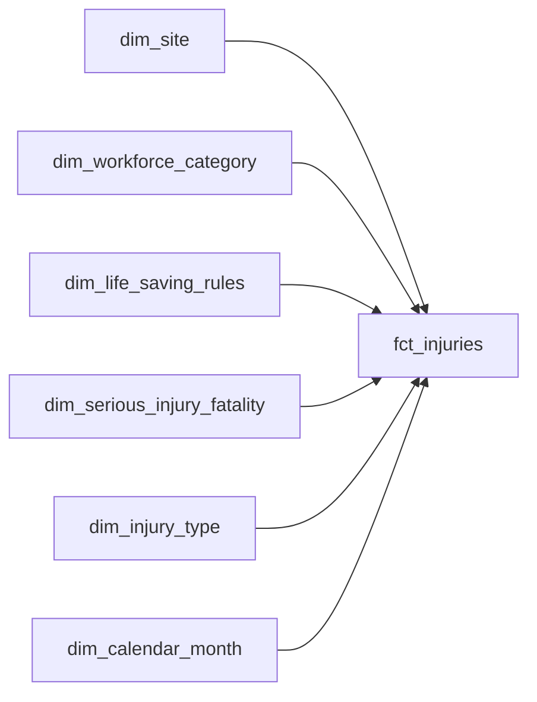

# Design — ADO Wiki + GitHub-compatible MD output

**Inputs locked from brainstorm**

| # | Question | Decision |
|---|---|---|
| 1 | ADO target surface | **Wiki** (not Repo .md, not PR descriptions) |
| 2 | Delivery | **Manual paste** (not Wiki-as-Code, not CI) |
| 3 | File structure | **Keep 6 files** (no per-table explosion) |
| 4 | `<details>` collapsibles | **Keep** (ADO Wiki renders them natively) |
| 5 | Badge/chip raw-MD fallback | **Hybrid: current span + emoji/unicode prefix** |
| 6 | Mermaid diagrams | **Now** (this release) |
| 7 | TOC form | *(unanswered — proposal below)* |

**Critical constraint from user** — *"we need to be sure that page anchors actually work"*.

Reference: [Syntax guidance for Markdown usage in Wiki — Azure DevOps](https://learn.microsoft.com/en-us/azure/devops/project/wiki/markdown-guidance?view=azure-devops).

---

## 1. Design goals

| Goal | Why | Measure |
|---|---|---|
| **G1. Every anchor clicks** | User's explicit blocker. Jump-to navs, TOCs, cross-references must all resolve in ADO Wiki. | Automated test: for each emitted doc, every `[text](#slug)` reference matches an ADO-derived slug of some heading in the same doc. |
| **G2. Same file works in ADO Wiki, GitHub, and the dashboard's inline renderer** | Manual paste into ADO Wiki is primary; GitHub is where the repo lives; the dashboard is where most users start. | Visual smoke on all three; automated check on structural invariants. |
| **G3. Badge/chip semantics survive CSS stripping** | ADO Wiki and GitHub both strip the `class="badge ..."` attribute. Today the pill degrades to plain text — readable but visually indistinct. | Unicode/emoji prefix inside each badge span so the raw-MD form is also visually recognisable. |
| **G4. Relationship + lineage graphs as Mermaid** | Both platforms + dashboard support Mermaid. Most-requested missing feature. | At least one new Mermaid block per measure (lineage) and per fact table (relationships). |
| **G5. No new runtime deps** | Zero-runtime-dep ethos. | `package.json` unchanged. |

Non-goals: ADO Wiki REST-API upload, per-table page splitting, translations.

---

## 2. The anchor problem — deep dive

This is the single risky part of the spec. ADO Wiki's heading-to-slug algorithm differs from GitHub's in subtle ways that breaks our existing anchors.

### 2.1 Current behaviour

Today, `src/md-generator.ts` has a `slug()` helper matching GitHub:

```ts
function slug(s: string): string {
  return String(s).toLowerCase()
    .replace(/[^\w\s-]/g, "")     // strip non-word (keeps letters/digits/_/-/space)
    .replace(/\s+/g, "-")
    .replace(/-+/g, "-")
    .replace(/^-+|-+$/g, "");
}
```

Every doc emits:
1. A **hand-rolled TOC** (`## Document Contents` with links like `[1. Introduction](#1-introduction)`)
2. **Jump-to navs** (`## Jump to` with table-of-tables links)
3. **Custom `<a id="...">` tags** before each section

### 2.2 What ADO Wiki actually does

From the reference doc, ADO Wiki's algorithm is (paraphrased):
1. Lowercase
2. Strip certain punctuation — `:`, `.`, `/`, `&`, `,`, `(`, `)`, `!`, `?`
3. Replace whitespace with hyphens
4. Keep underscores, keep existing hyphens
5. Collapse consecutive hyphens

**Custom `<a id>` tags are ignored.** ADO Wiki always derives its anchor from the heading text.

### 2.3 Gaps between our current slug and ADO

| Input heading | Our GitHub `slug()` | ADO's derived anchor | Match? |
|---|---|---|---|
| `## 2. Model Architecture` | `2-model-architecture` | `2-model-architecture` | ✅ |
| `## Date NEW` | `date-new` | `date-new` | ✅ |
| `## _measures` | `_measures` | `_measures` | ✅ |
| `## fct_health_safety` | `fct_health_safety` | `fct_health_safety` | ✅ |
| `## 4. Data Dictionary — Summary` (em-dash) | `4-data-dictionary--summary` | `4-data-dictionary--summary` | ✅ (both strip em-dash) |
| `## switch_hours_worked` | `switch_hours_worked` | `switch_hours_worked` | ✅ |
| `## Refresh Time Stamp` | `refresh-time-stamp` | `refresh-time-stamp` | ✅ |
| `## tt_lsr_with_lsr` | `tt_lsr_with_lsr` | `tt_lsr_with_lsr` | ✅ |
| `## LocalDateTable_10a54981-0e64-4feb-819e-b53b1ed412a0` | `localdatetable_10a54981-0e64-4feb-819e-b53b1ed412a0` | same | ✅ |
| Heading with `(parens)` | `parens` kept | `parens` stripped | ❌ |
| Heading with `,` comma | kept as text, no hyphen | stripped | ❌ |
| Heading with `/` slash | stripped → joined | stripped → joined | ✅ |
| Heading with `:` colon | kept as text | stripped | ❌ |

**Verdict**: the common cases match. The breakage surface is punctuation characters that GitHub strips via `[^\w\s-]` but ADO strips differently (ADO is more aggressive with specific chars).

**Our current content is mostly fine** — the H&S model doesn't have headings with `(parens)`, `:`, or `,` because Power BI doesn't typically allow those in table/measure names. But any model that DOES use them will break anchors silently.

### 2.4 Resolution — `adoSlug()` that matches ADO exactly, with tests

1. Introduce a new helper `adoSlug(s: string)` whose rules exactly mirror the ADO documentation. Keep `slug()` available as a fallback name if any other caller (client JS for dashboard navigation) depends on the old behaviour, but every MD generator switches to `adoSlug()`.

2. **Add an anchor-resolution test** per doc: extract every `[text](#anchor)` link from the emitted MD, assert each one matches the `adoSlug(heading)` of some heading in the same doc. This is the safety net the user asked for — "we need to be sure page anchors actually work" becomes a failing test if we regress.

3. **Drop `<a id="...">` tags from MD output.** They're ignored by ADO, redundant on GitHub (headings already get anchors), and add noise.

4. Keep the client-side dashboard navigation working by having the dashboard's own renderer use either the same `adoSlug()` OR continue using its existing algorithm on elements it owns. The MD content we embed is rendered by `mdRender` which produces `<h2>` elements — browser scrolls to them via the rendered heading's text. No HTML `<a id>` needed.

### 2.5 Proposed `adoSlug` algorithm

```ts
function adoSlug(heading: string): string {
  return heading
    .toLowerCase()
    // Strip the punctuation ADO Wiki itself strips
    .replace(/[:.,/&()!?'"`]/g, "")
    // Non-word chars (except underscore and hyphen) → hyphen
    .replace(/[^\w\-]+/g, "-")
    // Collapse consecutive hyphens
    .replace(/-+/g, "-")
    // Trim leading/trailing hyphens
    .replace(/^-+|-+$/g, "");
}
```

Test cases (must all pass):

| Input | Expected `adoSlug` |
|---|---|
| `"1. Introduction"` | `1-introduction` |
| `"Date NEW"` | `date-new` |
| `"_measures"` | `_measures` |
| `"fct_health_safety"` | `fct_health_safety` |
| `"4. Data Dictionary — Summary"` | `4-data-dictionary-summary` |
| `"Category (Type)"` | `category-type` |
| `"A, B, C"` | `a-b-c` |
| `"Col: Description"` | `col-description` |
| `"Sales / Cost"` | `sales-cost` |

---

## 3. Badge / chip raw-MD fallback — hybrid design

### 3.1 Current state

`<span class="badge badge--fk">FK</span>` renders as a styled pill in the dashboard; degrades to plain text `FK` in ADO / GitHub. `FK` without visual separation blurs into surrounding text.

### 3.2 Proposed hybrid

Add a leading Unicode marker INSIDE the span. Emojis + text, all inside the span:

```html
<span class="badge badge--fk">🔗 FK</span>
```

- **Dashboard:** CSS hides the text-content styling differences — the pill stays a pill with the emoji as an icon inside. No visual regression.
- **ADO Wiki / GitHub:** class is stripped; the viewer sees plain `🔗 FK`. The emoji creates visual separation without needing CSS.

### 3.3 Proposed marker set

| Badge | Marker | Rationale |
|---|---|---|
| `PK` | 🔑 | Key |
| `PK*` (inferred) | 🗝 | Skeleton key — inferred |
| `FK` | 🔗 | Link |
| `CALC` | 🧮 | Abacus — computation |
| `HIDDEN` | 👁 | Eye (struck-through in CSS) |
| `SLICER` | 🎚 | Level slider |
| `UNUSED` | ⚠ | Warning |
| `INDIRECT` | ↻ | Cycle — referenced-via-DAX |
| `DIRECT` / success | ✓ | Check |
| `EXTERNAL` | 🌐 | Globe — external model |
| `CALC GROUP` | 🧮 | Same as CALC (distinguishable by label text) |
| `DIRECTION-OUT` | → | Arrow |
| `DIRECTION-IN` | ← | Arrow |

**Alternative without emoji** — for ADO Wiki admins who dislike emoji, a fallback of single-char Unicode symbols (`◆`, `•`, `▲`, `✕`) — same signal, no emoji. Worth keeping a `--badge-style=emoji|symbol|text` flag in mind but **deferring** until we see demand. Default to emoji.

### 3.4 Chip markers

Chips in MD (`<span class="chip chip--measure">MyMeasure</span>`) currently render as plain text `MyMeasure` outside the dashboard. Less urgent than badges because chip content IS the label. Leave as-is for now.

---

## 4. Mermaid diagrams

### 4.1 Where they add value

| Location | Diagram type | Data source | Size estimate |
|---|---|---|---|
| `measures.md` per measure | Lineage graph (upstream measures + downstream visuals) | `m.daxDependencies` + `m.usedIn` | Small — usually 5-15 nodes |
| `data-dictionary.md` per fact table | Star fragment (this fact + its dimensions) | `table.relationships` | Small — 5-10 nodes |
| `model.md` top-level | Full star schema | All relationships | Large — H&S has 36 edges |

Proposed scope for v0.7:
- ✅ **Measure lineage** in `measures.md`
- ✅ **Per-table relationships** in `data-dictionary.md`
- ⏳ **Full-model overview** in `model.md` — deferred; too dense to be useful without collapse/interact

### 4.2 Example Mermaid output — measure lineage

```markdown
```mermaid
graph LR
  _TotalRevenue["Total Revenue"] --> [Sales %]
  _SalesCount["Sales Count"] --> [Sales %]
  ['Sales'[Quantity]]:::col --> _TotalRevenue
  [_TotalRevenue]:::current
  [Sales %]:::measure --> V1["Sales Dashboard"]:::visual
  classDef current fill:#f9e6b2
  classDef measure fill:#fff3cd
  classDef col fill:#cfe2ff
  classDef visual fill:#d1e7dd
```
```

- Upstream measures on the left, current measure in the middle, downstream visuals on the right.
- Node-id vs label — Mermaid nodes need safe IDs; labels carry the human name. Our `slug()` is a natural ID basis but we need to handle duplicates across measures/tables/visuals.

### 4.3 Example — per-table star fragment

```markdown

```

Simple directed graph. No styling on first cut.

### 4.4 Feature flag

Mermaid support is universal (GitHub, ADO Wiki, dashboard) but some users export to viewers that don't render it (plain text readers, PDF converters). Emit inside a fenced `mermaid` block — every non-Mermaid viewer falls back to showing the source as a code block. Usable; not pretty. No flag needed.

---

## 5. TOC strategy

**Proposal: dual emit.**

```markdown
[[_TOC_]]

## Document Contents

1. [Introduction](#1-introduction)
2. [Model Architecture](#2-model-architecture)
...
```

- ADO Wiki: `[[_TOC_]]` auto-generates its own TOC at that position. The hand-rolled list below is a duplicate — we might want to **omit the hand-rolled list when ADO is the target**.
- GitHub: `[[_TOC_]]` renders as literal text (`[[_TOC_]]` visible in the page). The hand-rolled list below is the real TOC.
- Dashboard: `[[_TOC_]]` renders as literal text too (our `mdRender` doesn't special-case it). Hand-rolled list is the real TOC.

**Cleanest compromise:** render `[[_TOC_]]` as a standalone line AND keep the hand-rolled list. ADO shows TWO TOCs but that's uglier than two platforms showing one each. Alternatively, hide the hand-rolled one behind `<details><summary>Manual TOC</summary>…</details>` — ADO shows auto + collapsed manual; GitHub shows manual with a visible-but-inert `[[_TOC_]]` banner above it.

**Recommendation:** emit `[[_TOC_]]` only when the environment flag `POWERBI_LINEAGE_MD_TARGET=ado` is set. Otherwise keep the hand-rolled form. Default to "both" (no flag, hand-rolled only, works on every platform). The user can flip the flag before a wiki-paste run if they want ADO's auto-TOC.

---

## 6. File structure

**Unchanged.** Six files, same names. The user locked this in during brainstorm.

```
Health_and_Safety_Model.md
Health_and_Safety_DataDictionary.md
Health_and_Safety_Measures.md
Health_and_Safety_Functions.md
Health_and_Safety_CalcGroups.md
Health_and_Safety_Quality.md
```

*(Current dashboard UI exports them as in-memory strings; the six-file layout is a paste-six-pages workflow in ADO Wiki. We don't need per-page filenames because the user is pasting.)*

Cross-document links stay as "Companion document" front-matter text — no hyperlinks between files because the filenames depend on the wiki layout the user chooses.

---

## 7. Module-level changes

| Area | Change | File |
|---|---|---|
| `adoSlug()` helper + tests | New | `src/md-generator.ts`, `tests/md-anchors.test.ts` |
| Switch all anchors to `adoSlug()` | Edit | `src/md-generator.ts` |
| Drop `<a id>` tags from MD | Edit | `src/md-generator.ts` |
| Badge emoji prefixes | Edit | `BADGE_*` constants in `src/md-generator.ts`; dashboard CSS for visual parity |
| Per-measure Mermaid lineage | New | `generateMeasuresMd` block in `src/md-generator.ts` |
| Per-table Mermaid relationships | New | `generateDataDictionaryMd` block in `src/md-generator.ts` |
| Anchor-resolution tests | New | `tests/md-anchors.test.ts` |
| Feature flag `POWERBI_LINEAGE_MD_TARGET` | New | `src/md-generator.ts` (env read) |
| CHANGELOG + version bump to 0.7.0 | Edit | `CHANGELOG.md`, `package.json` |

No changes required on the data layer — Mermaid pulls from existing `daxDependencies`, `usedIn`, `relationships`.

---

## 8. Testing contract

### 8.1 Slug correctness — unit

`tests/md-anchors.test.ts` adds a `adoSlug` round-trip suite with ~15 cases:

```ts
const cases: [string, string][] = [
  ["1. Introduction", "1-introduction"],
  ["Date NEW", "date-new"],
  ["_measures", "_measures"],
  ["Col: Description", "col-description"],
  ["Category (Type)", "category-type"],
  // ... 10 more
];
for (const [input, expected] of cases) {
  test(`adoSlug("${input}") === "${expected}"`, () => assert.equal(adoSlug(input), expected));
}
```

### 8.2 Anchor resolution — integration

For each of the six docs, compute every `(#anchor)` reference and every `## Heading`, then assert the reference-set is a subset of the heading-slug-set. One test per doc — runs against the real H&S fixture.

```ts
for (const [name, md] of Object.entries(generated)) {
  test(`${name}.md — every anchor reference resolves`, () => {
    const refs = [...md.matchAll(/\]\(#([^)]+)\)/g)].map(m => m[1]);
    const headings = [...md.matchAll(/^##+\s+(.+)$/gm)].map(m => adoSlug(m[1]));
    const unresolved = refs.filter(r => !headings.includes(r));
    assert.equal(unresolved.length, 0, `broken anchors: ${unresolved.join(", ")}`);
  });
}
```

### 8.3 No `<a id>` tags emitted

Simple substring check — `!md.includes("<a id=")` in each doc.

### 8.4 Badge fallback text contains the Unicode marker

`md.includes("🔑 PK")` etc. — one assertion per badge type.

### 8.5 Mermaid blocks present when expected

For a composite / relationship-bearing model, assert at least one ``` ```mermaid ``` ``` block in measures.md (per proxy measure) and in data-dictionary.md (per fact table). Gate on feature presence.

---

## 9. Risks + mitigations

| Risk | Likelihood | Impact | Mitigation |
|---|---|---|---|
| ADO's slug algorithm differs in some edge case we miss | Medium | Broken anchors in real-world models | Test suite pins ~15 cases; user reports extend it |
| Mermaid diagrams blow up visual length on big models | Medium | Noisy docs | Only per-measure + per-fact-table; explicit "no full-model graph" rule |
| Emoji renders differently across platforms | Low | Slight visual drift | Platform emoji is reliable in 2026 for common symbols |
| User's wiki engine is an older ADO Server version with different slug rules | Low | Same as first row | Ship with `POWERBI_LINEAGE_MD_TARGET=ado|ado-2019|github` allowlist; default `ado` = modern rules |
| Anchor test regresses on a future model shape | Medium | CI fires | Exactly what we want — the test is the safety net |

---

## 10. Open questions (to settle before `/sc:workflow`)

1. **TOC strategy** — unanswered in brainstorm. Proposal: `[[_TOC_]]` only when `POWERBI_LINEAGE_MD_TARGET=ado`; hand-rolled always. Default env = unset = hand-rolled only. Good?
2. **Emoji vs symbol markers** — proposal defaults to emoji. Any concern about ADO Wiki's emoji rendering on older clients?
3. **Mermaid overview diagrams in `model.md` §2** — deferred or included? Star-schema overview for H&S would be 40+ nodes and 36 edges; ugly without Mermaid's interactive expand. Proposal: defer.
4. **File naming for wiki paste** — when the user pastes, they name the page. Today the MD has no filename-ish hint at the top (just `# Document Title`). Worth adding a suggested-filename callout (`<!-- suggested wiki page: Health_and_Safety/Model -->`)?

---

## 11. Next step

Greenlight this design and the four open questions, then `/sc:workflow` breaks it into commits. Rough sizing: ~half a day of implementation (most of it the `adoSlug` + anchor test suite; Mermaid is ~50 lines each).
